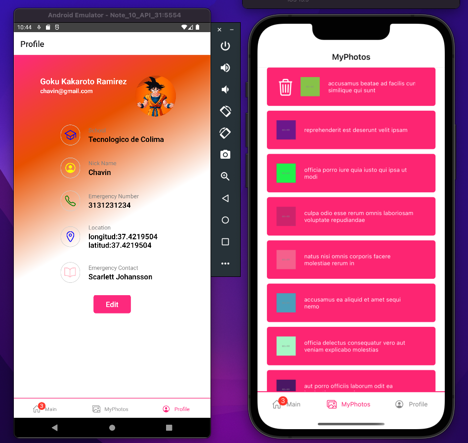

# ChallengeApp

This app was a challenge from my TL. The creation of this app worked to improve and practice
how to use react native components, and to access native phone features (store, gallery, fingerprint sensor, etc). 

Background degradation was added, and an image plugin allows the detection of image colors in order to set a background with relative colors to the image.

Features:
- Draggable list
- Sortable list
- Swipe to delete
- Fingerprint to log in
- Select images from the gallery
- Save info in AsynStorage
- splash screen 

\
\

Components and libraries used for this app:

- [LinearGradient](https://github.com/react-native-linear-gradient/react-native-linear-gradient) (used for make a degraded background)
- [Carrousel](https://github.com/meliorence/react-native-snap-carousel) (this is deprecated but you can still use the [fork](apurba-bware/react-native-snap-carousel#5a7f809e921262e4e2f646e8cfc4da85f7bd663d)) 
- Animated - to apply effects (fadeIn...)
- [image-colors](https://github.com/osamaqarem/react-native-image-colors) (to extract the colors of the image and change the background according to it)
- [asyn storage](https://github.com/react-native-async-storage/async-storage) (to save the data on the phone)
- [checkbox](https://github.com/react-native-checkbox/react-native-checkbox) (to use checkbox as a part of a form)
- [geolocalization](https://www.npmjs.com/package/@react-native-community/geolocation) (to extract the location of the phone)
- [biometrics](https://www.npmjs.com/package/react-native-biometrics) (to use the fingerprint sensor)
- [draggable flatlist](https://github.com/computerjazz/react-native-draggable-flatlist) (to sort a list by dragging its items)
- [splash screen](https://github.com/crazycodeboy/react-native-splash-screen) (to create an splash screen) watch this [tutorial](https://medium.com/@appstud/add-a-splash-screen-to-a-react-native-app-810492e773f9)